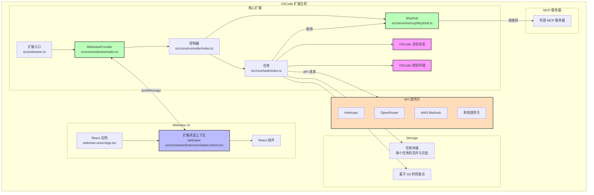

# Cline 扩展架构与开发指南

## 项目概述

Cline 是一个 VSCode 扩展，通过核心后端和基于 React 的 webview 前端为用户提供 AI 助手功能。该扩展使用 TypeScript 构建，遵循模块化架构模式。

## 架构总览



## 术语定义

- **核心扩展**：src 文件夹内的所有内容，按模块组织
- **核心扩展状态**：由 src/core/controller/index.ts 中的 Controller 类管理，作为扩展状态的唯一数据源。它管理多种持久化存储（全局状态、工作区状态和密钥），负责状态分发到核心扩展和 webview 组件，并协调多个扩展实例的状态。这包括 API 配置、任务历史、设置和 MCP 配置。
- **Webview**：webview-ui 内的所有内容。所有用户可见的 React 视图和交互组件
- **Webview 状态**：由 webview-ui/src/context/ExtensionStateContext.tsx 中的 ExtensionStateContext 管理，通过 context provider 模式为 React 组件提供扩展状态访问。它维护 UI 组件的本地状态，处理消息事件的实时更新，管理流式内容的部分更新，并通过自定义 hook（useExtensionState）提供类型安全的状态访问。context 包含扩展版本、消息、任务历史、主题、API 配置、MCP 服务器、市场目录和工作区文件路径。它通过 VSCode 的消息传递系统与核心扩展同步。

### 核心扩展架构

核心扩展遵循清晰的层级结构：

1. **WebviewProvider**（src/core/webview/index.ts）：管理 webview 生命周期和通信
2. **Controller**（src/core/controller/index.ts）：处理 webview 消息和任务管理
3. **Task**（src/core/task/index.ts）：执行 API 请求和工具操作

这种架构实现了关注点分离：
- WebviewProvider 专注于 VSCode webview 集成
- Controller 管理状态并协调任务
- Task 负责 AI 请求和工具操作的执行

### WebviewProvider 实现

WebviewProvider 类（src/core/webview/index.ts）负责：

- 通过静态集合（activeInstances）管理多个活动实例
- 处理 webview 生命周期事件（创建、可见性变化、销毁）
- 实现带有 CSP 头的 HTML 内容生成
- 支持开发时的热模块替换（HMR）
- 设置 webview 与扩展之间的消息监听器

WebviewProvider 持有 Controller 的引用，并将消息处理委托给它。它还负责创建侧边栏和标签面板 webview，使 Cline 能在 VSCode 的不同上下文中使用。

### 核心扩展状态

Controller 类管理多种持久化存储：

- **全局状态**：跨所有 VSCode 实例存储。用于需要全局持久化的设置和数据。
- **工作区状态**：当前工作区专属。用于任务相关的数据和设置。
- **密钥**：用于敏感信息（如 API 密钥）的安全存储。

Controller 负责将状态分发到核心扩展和 webview 组件，并协调多个扩展实例间的状态一致性。

状态同步通过以下方式实现：
- 基于文件的任务历史和会话数据存储
- VSCode 全局状态 API 用于设置和配置
- 密钥存储用于敏感信息
- 文件变更和配置更新的事件监听

Controller 实现了以下方法：
- 保存和加载任务状态
- 管理 API 配置
- 处理用户认证
- 协调 MCP 服务器连接
- 管理任务历史和检查点

### Webview 状态

webview-ui/src/context/ExtensionStateContext.tsx 中的 ExtensionStateContext 通过 context provider 模式为 React 组件提供扩展状态访问。context 包含：

- 扩展版本
- 消息
- 任务历史
- 主题
- API 配置
- MCP 服务器
- 市场目录
- 工作区文件路径

它通过 VSCode 的消息传递系统与核心扩展同步，并通过自定义 hook（useExtensionState）提供类型安全的状态访问。

ExtensionStateContext 负责：
- 通过消息事件实现实时更新
- 支持流式内容的部分消息更新
- 通过 setter 方法修改状态
- 通过自定义 hook 类型安全地访问状态

## API 提供方系统

Cline 通过模块化 API 提供方系统支持多家 AI 服务商。每个提供方在 src/api/providers/ 目录下实现，遵循统一接口。

### API 提供方架构

API 系统包括：

1. **API 处理器**：src/api/providers/ 下的各提供方实现
2. **API 转换器**：src/api/transform/ 下的流转换工具
3. **API 配置**：用户的 API 密钥和端点设置
4. **API 工厂**：用于创建对应处理器的构建函数

主要支持的提供方有：
- **Anthropic**：直接集成 Claude 模型
- **OpenRouter**：支持多模型的元提供方
- **AWS Bedrock**：集成亚马逊 AI 服务
- **Gemini**：谷歌 AI 模型
- **Cerebras**：高性能 Llama、Qwen、DeepSeek 推理
- **Ollama**：本地模型托管
- **LM Studio**：本地模型托管
- **VSCode LM**：VSCode 内置语言模型

### API 配置管理

API 配置安全存储：
- API 密钥存储于 VSCode 密钥存储
- 模型选择和非敏感设置存储于全局状态
- Controller 管理提供方切换和配置更新

系统支持：
- API 密钥安全存储
- 模型选择与配置
- 自动重试与错误处理
- Token 使用与费用统计
- 上下文窗口管理

### 计划/执行模式下的 API 配置

Cline 支持计划（Plan）和执行（Act）模式下分别配置模型：
- 可为计划与执行分别选择不同模型
- 切换模式时保留各自模型选择
- Controller 负责模式切换与配置更新

## 任务执行系统

Task 类负责执行 AI 请求和工具操作。每个任务独立运行，确保状态隔离和管理。

### 任务执行循环

核心任务执行循环如下：

```typescript
class Task {
  async initiateTaskLoop(userContent: UserContent, isNewTask: boolean) {
    while (!this.abort) {
      // 1. 发起 API 请求并流式响应
      const stream = this.attemptApiRequest()
      
      // 2. 解析并展示内容块
      for await (const chunk of stream) {
        switch (chunk.type) {
          case "text":
            // 解析为内容块
            this.assistantMessageContent = parseAssistantMessageV2(chunk.text)
            // 展示内容块
            await this.presentAssistantMessage()
            break
        }
      }
      
      // 3. 等待工具执行完成
      await pWaitFor(() => this.userMessageContentReady)
      
      // 4. 用工具结果继续循环
      const recDidEndLoop = await this.recursivelyMakeClineRequests(
        this.userMessageContent
      )
    }
  }
}
```

### 消息流系统

流系统处理实时更新和部分内容：

```typescript
class Task {
  async presentAssistantMessage() {
    // 处理流锁，防止竞态
    if (this.presentAssistantMessageLocked) {
      this.presentAssistantMessageHasPendingUpdates = true
      return
    }
    this.presentAssistantMessageLocked = true

    // 展示当前内容块
    const block = this.assistantMessageContent[this.currentStreamingContentIndex]
    
    // 处理不同类型内容
    switch (block.type) {
      case "text":
        await this.say("text", content, undefined, block.partial)
        break
      case "tool_use":
        // 处理工具执行
        break
    }

    // 完成后进入下一个块
    if (!block.partial) {
      this.currentStreamingContentIndex++
    }
  }
}
```

### 工具执行流程

工具遵循严格的执行模式：

```typescript
class Task {
  async executeToolWithApproval(block: ToolBlock) {
    // 1. 检查自动批准设置
    if (this.shouldAutoApproveTool(block.name)) {
      await this.say("tool", message)
      this.consecutiveAutoApprovedRequestsCount++
    } else {
      // 2. 请求用户批准
      const didApprove = await askApproval("tool", message)
      if (!didApprove) {
        this.didRejectTool = true
        return
      }
    }

    // 3. 执行工具
    const result = await this.executeTool(block)

    // 4. 保存检查点
    await this.saveCheckpoint()

    // 5. 返回结果给 API
    return result
  }
}
```

### 错误处理与恢复

系统包含健壮的错误处理：

```typescript
class Task {
  async handleError(action: string, error: Error) {
    // 1. 检查任务是否已放弃
    if (this.abandoned) return
    
    // 2. 格式化错误信息
    const errorString = `错误 ${action}: ${error.message}`
    
    // 3. 展示错误给用户
    await this.say("error", errorString)
    
    // 4. 添加到工具结果
    pushToolResult(formatResponse.toolError(errorString))
    
    // 5. 清理资源
    await this.diffViewProvider.revertChanges()
    await this.browserSession.closeBrowser()
  }
}
```

### API 请求与 Token 管理

Task 类内置重试、流式和 token 管理：

```typescript
class Task {
  async *attemptApiRequest(previousApiReqIndex: number): ApiStream {
    // 1. 等待 MCP 服务器连接
    await pWaitFor(() => this.controllerRef.deref()?.mcpHub?.isConnecting !== true)

    // 2. 管理上下文窗口
    const previousRequest = this.clineMessages[previousApiReqIndex]
    if (previousRequest?.text) {
      const { tokensIn, tokensOut } = JSON.parse(previousRequest.text || "{}")
      const totalTokens = (tokensIn || 0) + (tokensOut || 0)
      
      // 超限时截断会话
      if (totalTokens >= maxAllowedSize) {
        this.conversationHistoryDeletedRange = this.contextManager.getNextTruncationRange(
          this.apiConversationHistory,
          this.conversationHistoryDeletedRange,
          totalTokens / 2 > maxAllowedSize ? "quarter" : "half"
        )
      }
    }

    // 3. 自动重试流
    try {
      this.isWaitingForFirstChunk = true
      const firstChunk = await iterator.next()
      yield firstChunk.value
      this.isWaitingForFirstChunk = false
      
      // 流剩余内容
      yield* iterator
    } catch (error) {
      // 4. OpenRouter 自动重试
      if (isOpenRouter && !this.didAutomaticallyRetryFailedApiRequest) {
        await setTimeoutPromise(1000)
        this.didAutomaticallyRetryFailedApiRequest = true
        yield* this.attemptApiRequest(previousApiReqIndex)
        return
      }
      
      // 5. 自动重试失败后询问用户
      const { response } = await this.ask(
        "api_req_failed",
        this.formatErrorWithStatusCode(error)
      )
      if (response === "yesButtonClicked") {
        await this.say("api_req_retried")
        yield* this.attemptApiRequest(previousApiReqIndex)
        return
      }
    }
  }
}
```

主要特性：

1. **上下文窗口管理**
   - 跟踪每次请求的 token 使用
   - 超限时自动截断会话
   - 保留重要上下文
   - 适配不同模型的上下文大小

2. **流式架构**
   - 实时分块处理
   - 支持部分内容
   - 防止竞态
   - 流式错误恢复

3. **错误处理**
   - 短暂故障自动重试
   - 持续故障用户确认重试
   - 详细错误报告
   - 失败时状态清理

4. **Token 统计**
   - 单次请求 token 统计
   - 累计使用统计
   - 费用计算
   - 缓存命中监控

### 上下文管理系统

上下文管理系统负责会话历史截断，防止上下文窗口溢出。由 ContextManager 类实现，保证长会话在模型上下文限制内，同时保留关键信息。

主要特性：

1. **模型感知大小**：根据不同模型动态调整上下文窗口（DeepSeek 64K，大多数模型 128K，Claude 200K）。
2. **主动截断**：监控 token 使用，接近上限时预截断，按模型保留 27K-40K token 缓冲。
3. **智能保留**：始终保留原始任务消息，截断时保持用户-助手对话结构。
4. **自适应策略**：根据压力不同采用不同截断策略——中等压力去掉一半，严重压力去掉四分之三。
5. **错误恢复**：针对不同提供方的上下文溢出错误自动重试并更激进截断。

### 任务状态与恢复

Task 类提供健壮的任务状态管理与恢复能力：

```typescript
class Task {
  async resumeTaskFromHistory() {
    // 1. 加载保存状态
    this.clineMessages = await getSavedClineMessages(this.getContext(), this.taskId)
    this.apiConversationHistory = await getSavedApiConversationHistory(this.getContext(), this.taskId)

    // 2. 处理中断的工具执行
    const lastMessage = this.apiConversationHistory[this.apiConversationHistory.length - 1]
    if (lastMessage.role === "assistant") {
      const toolUseBlocks = content.filter(block => block.type === "tool_use")
      if (toolUseBlocks.length > 0) {
        // 添加中断的工具响应
        const toolResponses = toolUseBlocks.map(block => ({
          type: "tool_result",
          tool_use_id: block.id,
          content: "任务在此工具调用完成前被中断。"
        }))
        modifiedOldUserContent = [...toolResponses]
      }
    }

    // 3. 通知中断
    const agoText = this.getTimeAgoText(lastMessage?.ts)
    newUserContent.push({
      type: "text",
      text: `[任务恢复] 此任务在 ${agoText} 前被中断。可能未完成，请重新评估任务上下文。`
    })

    // 4. 恢复任务执行
    await this.initiateTaskLoop(newUserContent, false)
  }

  private async saveTaskState() {
    // 保存会话历史
    await saveApiConversationHistory(this.getContext(), this.taskId, this.apiConversationHistory)
    await saveClineMessages(this.getContext(), this.taskId, this.clineMessages)
    
    // 创建检查点
    const commitHash = await this.checkpointTracker?.commit()
    
    // 更新任务历史
    await this.controllerRef.deref()?.updateTaskHistory({
      id: this.taskId,
      ts: lastMessage.ts,
      task: taskMessage.text,
      // ... 其他元数据
    })
  }
}
```

任务状态管理要点：

1. **任务持久化**
   - 每个任务有唯一 ID 和专属存储目录
   - 每条消息后保存会话历史
   - 文件变更通过 Git 检查点跟踪
   - 终端输出和浏览器状态也被保存

2. **状态恢复**
   - 任务可从任意点恢复
   - 中断的工具执行被优雅处理
   - 文件变更可从检查点恢复
   - 上下文跨 VSCode 会话保留

3. **工作区同步**
   - 文件变更通过 Git 跟踪
   - 工具执行后创建检查点
   - 状态可恢复到任意检查点
   - 检查点间可对比变更

4. **错误恢复**
   - 失败的 API 请求可重试
   - 中断的工具执行被标记
   - 资源被妥善清理
   - 用户被通知状态变化

## 计划/执行模式系统

Cline 实现了计划与执行分离的双模式系统：

### 模式架构

计划/执行模式系统包括：

1. **模式状态**：存储于 Controller 状态的 chatSettings.mode
2. **模式切换**：由 Controller 的 togglePlanActModeWithChatSettings 处理
3. **模式专属模型**：可为每种模式配置不同模型
4. **模式专属提示词**：计划与执行使用不同系统提示词

### 模式切换流程

切换模式时：

1. 当前模型配置保存到模式专属状态
2. 恢复前一模式的模型配置
3. Task 实例更新为新模式
4. webview 被通知模式变化
5. 采集遥测事件用于分析

### 计划模式

计划模式用于：
- 信息收集与上下文构建
- 提问澄清
- 制定详细执行计划
- 与用户讨论方案

在计划模式下，AI 仅使用 plan_mode_respond 工具进行对话规划，不执行实际操作。

### 执行模式

执行模式用于：
- 执行已规划的操作
- 使用工具修改文件、运行命令等
- 实现解决方案
- 提供结果与完成反馈

在执行模式下，AI 可用除 plan_mode_respond 外的所有工具，专注于实现而非讨论。

## 数据流与状态管理

### 核心扩展角色

Controller 作为所有持久化状态的唯一数据源：
- 管理 VSCode 全局状态和密钥存储
- 协调组件间状态更新
- 保证 webview 重载时状态一致
- 处理任务专属状态持久化
- 管理检查点创建与恢复

### 终端管理

Task 类管理终端实例与命令执行：

```typescript
class Task {
  async executeCommandTool(command: string): Promise<[boolean, ToolResponse]> {
    // 1. 获取或创建终端
    const terminalInfo = await this.terminalManager.getOrCreateTerminal(cwd)
    terminalInfo.terminal.show()

    // 2. 流式输出执行命令
    const process = this.terminalManager.runCommand(terminalInfo, command)
    
    // 3. 实时输出处理
    let result = ""
    process.on("line", (line) => {
      result += line + "\n"
      if (!didContinue) {
        sendCommandOutput(line)
      } else {
        this.say("command_output", line)
      }
    })

    // 4. 等待完成或用户反馈
    let completed = false
    process.once("completed", () => {
      completed = true
    })

    await process

    // 5. 返回结果
    if (completed) {
      return [false, `命令已执行。\n${result}`]
    } else {
      return [
        false,
        `命令仍在用户终端运行。\n${result}\n\n你将在未来收到终端状态和新输出的更新。`
      ]
    }
  }
}
```

主要特性：
1. **终端实例管理**
   - 多终端支持
   - 终端状态跟踪（忙/空闲）
   - 进程冷却监控
   - 每终端输出历史

2. **命令执行**
   - 实时输出流
   - 用户反馈处理
   - 进程状态监控
   - 错误恢复

### 浏览器会话管理

Task 类通过 Puppeteer 管理浏览器自动化：

```typescript
class Task {
  async executeBrowserAction(action: BrowserAction): Promise<BrowserActionResult> {
    switch (action) {
      case "launch":
        // 1. 固定分辨率启动浏览器
        await this.browserSession.launchBrowser()
        return await this.browserSession.navigateToUrl(url)

      case "click":
        // 2. 坐标点击
        return await this.browserSession.click(coordinate)

      case "type":
        // 3. 键盘输入
        return await this.browserSession.type(text)

      case "close":
        // 4. 资源清理
        return await this.browserSession.closeBrowser()
    }
  }
}
```

主要特性：
1. **浏览器控制**
   - 固定 900x600 分辨率窗口
   - 每任务生命周期单实例
   - 任务完成自动清理
   - 控制台日志捕获

2. **交互处理**
   - 基于坐标的点击
   - 键盘输入模拟
   - 截图
   - 错误恢复

## MCP（模型上下文协议）集成

### MCP 架构

MCP 系统包括：

1. **McpHub 类**：src/services/mcp/McpHub.ts 中的中央管理器
2. **MCP 连接**：管理外部 MCP 服务器连接
3. **MCP 设置**：JSON 文件中的配置
4. **MCP 市场**：在线 MCP 服务器目录
5. **MCP 工具与资源**：已连接服务器暴露的能力

McpHub 类：
- 管理 MCP 服务器连接生命周期
- 通过设置文件管理服务器配置
- 提供调用工具和访问资源的方法
- 实现 MCP 工具的自动批准设置
- 监控服务器健康并处理重连

### MCP 服务器类型

Cline 支持两类 MCP 服务器连接：
- **Stdio**：基于命令行的标准输入输出通信服务器
- **SSE**：基于 HTTP 的 Server-Sent Events 通信服务器

### MCP 服务器管理

McpHub 类提供：
- 发现与连接 MCP 服务器
- 监控服务器健康与状态
- 需要时重启服务器
- 管理服务器配置
- 设置超时与自动批准规则

### MCP 工具集成

MCP 工具集成到 Task 执行系统：
- 工具在连接时被发现和注册
- Task 类可通过 McpHub 调用 MCP 工具
- 工具结果流式返回给 AI
- 可为每个工具配置自动批准

### MCP 市场

MCP 市场提供：
- 可用 MCP 服务器目录
- 一键安装
- README 预览
- 服务器状态监控

Controller 类通过 McpHub 服务管理 MCP 服务器：

```typescript
class Controller {
  mcpHub?: McpHub

  constructor(context: vscode.ExtensionContext, outputChannel: vscode.OutputChannel, webviewProvider: WebviewProvider) {
    this.mcpHub = new McpHub(this)
  }

  async downloadMcp(mcpId: string) {
    // 从市场获取服务器详情
    const response = await axios.post<McpDownloadResponse>(
      "https://api.cline.bot/v1/mcp/download",
      { mcpId },
      {
        headers: { "Content-Type": "application/json" },
        timeout: 10000,
      }
    )

    // 用 README 上下文创建任务
    const task = `设置 MCP 服务器：${mcpDetails.githubUrl}...`

    // 初始化任务并显示聊天视图
    await this.initClineWithTask(task)
  }
}
```

## 结论

本指南全面介绍了 Cline 扩展的架构，重点讲解了状态管理、数据持久化和代码组织。遵循这些模式可确保各功能实现具备健壮的状态处理能力。

请记住：
- 重要状态务必持久化
- 核心扩展遵循 WebviewProvider -> Controller -> Task 流程
- 所有状态和消息均应类型安全
- 处理好错误和边界情况
- 测试 webview 重载下的状态持久化
- 新功能遵循既有模式
- 新代码放在合适目录
- 依赖安装到正确的 package.json

## 贡献指南

欢迎为 Cline 扩展贡献代码！请遵循以下准则：

添加新工具或 API 提供方时，请遵循 src/integrations/ 和 src/api/providers/ 目录下的既有模式。确保代码有良好注释并包含适当的错误处理。

.clineignore 文件允许用户指定 Cline 不应访问的文件和目录。实现新功能时请遵守 .clineignore 规则，确保代码不会读取或修改被忽略的文件。
