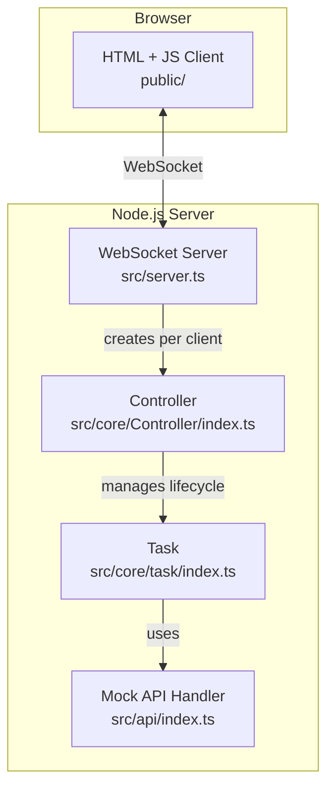

# Mini Cline Architecture - WebSocket Edition

This project is a minimal, mocked implementation of an AI-powered application architecture, using **WebSockets** for real-time, bidirectional communication between a web frontend and a Node.js backend.

It demonstrates a robust pattern for building interactive AI tools where the user interacts with a **Controller** (Virtual Character).

## Core Architecture

The architecture is composed of a decoupled frontend and backend, communicating over WebSockets. Each client session is managed by a dedicated `Controller` instance on the server.



### Component Roles

1.  **`server.ts` (Entry Point)**
    - Starts an Express server to serve the static frontend files.
    - Starts a WebSocket server.
    - For each new client that connects, it creates a dedicated **`Controller`** instance, ensuring user sessions are isolated.

2.  **`Controller` (`src/core/Controller/index.ts`)**
    - The "brain" or personality for a single client session. It represents the virtual character the user interacts with.
    - Manages the application state for that client (e.g., message history, task status).
    - Handles all incoming WebSocket messages from its client.
    - Orchestrates the lifecycle of `Task` objects.
    - Pushes state updates and logs back to the client via its WebSocket connection.

3.  **`Task` (`src/core/task/index.ts`)**
    - The "workhorse" that executes a single user request on behalf of the `Controller`.
    - Contains the core agent loop: call API -> get text and tool calls -> execute tools -> repeat.
    - It is completely decoupled from the communication layer and simply uses callbacks to send messages and logs up to the `Controller`.

4.  **`Frontend` (`public/`)**
    - A simple HTML and vanilla JavaScript client.
    - Establishes a WebSocket connection to the server.
    - Sends user commands (start task, cancel task) to its dedicated `Controller` on the server.
    - Listens for `stateUpdate` and `log` messages to dynamically render the UI.

### Data Flow

1.  User types a prompt in the browser and clicks "Send".
2.  The JS client sends a `{ "type": "new_task", ... }` message over the WebSocket.
3.  The `server.ts` receives the message and passes it to the corresponding client's `Controller`.
4.  The `Controller` updates its state (`isTaskRunning = true`), creates a `Task` instance, and starts it.
5.  The `Controller` sends a `stateUpdate` to the client. The client UI disables the input field.
6.  The `Task` runs its loop. As it generates text or executes tools, it uses callbacks to send messages and logs up to the `Controller`.
7.  The `Controller` receives these updates and immediately forwards them in `stateUpdate` and `log` messages to the client.
8.  The client's JavaScript receives these messages and updates the DOM, creating the live, streaming effect.
9.  When the task is finished or canceled, the `Controller` sets `isTaskRunning = false` and sends a final `stateUpdate`, re-enabling the UI controls.

## How to Run

1.  **Install dependencies:**
    ```bash
    npm install
    ```
2.  **Start the server:**
    ```bash
    npm start
    ```
3.  Open your browser and navigate to `http://localhost:3000`.
4.  You can now interact with the application.
